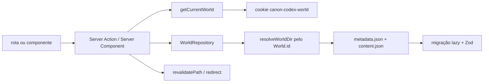

# Visão de arquitetura

Esta página descreve o caminho de execução verificado em 23/09/2026. As justificativas de produto
ficam nos [ADRs](.) e não são repetidas aqui.

## Mapa do código

```text
src/app/                         entrada HTTP e navegação Next App Router
  (wiki)/                        biblioteca, calendário, catálogos e telas de edição/leitura
  actions/                       mutações de negócio via Server Actions
  api/                           upload, leitura de assets, busca e snapshots
src/components/                  UI client/server, Tiptap, tldraw e projeção
src/services/                    casos de uso: mundos, busca e referência de assets
src/domain/                      schemas Zod, tipos e formatos persistidos
src/repositories/contracts/      fronteiras de persistência
src/repositories/filesystem/    implementação JSON/filesystem
src/lib/fs/                      caminhos, existência e escrita atômica
src/lib/migrations/              aplicação lazy de versões
```

`domain/` não faz I/O. Componentes não devem conhecer nomes de arquivos. A factory em
`src/repositories/index.ts` mantém a escolha do driver em um único lugar. No estado atual existem
quatro contratos: `WorldRepository`, `AssetStore`, `BoardRepository` e `SceneRepository`.

## Leitura e gravação de entidade



1. `getCurrentWorld()` lista mundos e lê `canon-codex-world`; se o cookie não apontar para um
   mundo existente, usa o primeiro da lista. A seleção não é autenticação.
2. `resolveWorldDir(worldId)` percorre os diretórios e compara o `id` dentro de `world.json`; o
   nome do diretório é um detalhe atual, normalmente o slug.
3. `FileSystemWorldRepository` lê `metadata.json` com `readMigratedJson`, aplica `entityMigrations`
   e valida `EntitySchema`. `content.json` segue o mesmo padrão com `contentMigrations` e
   `ContentDocumentSchema`.
4. Criar uma entidade valida `NewEntityInputSchema`, gera UUID, deriva slug, cria `metadata.json`
   e um `content.json` vazio. Atualizar valida `EntityPatchSchema`, preserva o UUID, recalcula o
   slug quando o título muda e grava a entidade.
5. `saveContent` valida o documento completo; relações validam `NewRelationInputSchema` e
   `RelationSchema`. Backlinks são calculados lendo todas as entidades e procurando relações cujo
   `targetId` seja o alvo.
6. A escrita JSON usa `atomicWriteJson` de `src/lib/fs/atomicWrite.ts`: serializa, escreve um
   temporário irmão e faz `rename` no mesmo volume. Se a serialização ou escrita falhar, o
   temporário é removido e o arquivo anterior não é substituído.

Há uma verificação opcional de concorrência em `EntityPatch.expectedUpdatedAt`; se estiver
desatualizada, `ConcurrentModificationError` impede a gravação. As ações de UI atuais não enviam
esse campo, portanto não há resolução de conflito visual implementada.

## Fluxo de assets

`POST /api/assets` e as ações de capa/símbolo recebem um arquivo, validam um MIME de imagem
suportado e chamam `AssetStore.importFromBuffer`. O `FileSystemAssetStore`:

1. gera um UUID;
2. copia/grava o original em `assets/<assetId>/original.<ext>`;
3. usa `sharp` para descobrir dimensões e tentar criar `thumbnail.webp` de até 480 px;
4. grava `asset.json` validado.

A falha do binding nativo do `sharp` degrada a importação para `hasThumbnail: false`, mas o
original continua sendo salvo. A UI só guarda `assetId`; `assetVariantUrl` monta
`/api/assets/<assetId>/<variant>`, e o handler resolve o caminho via `AssetStore`. O acesso usa o
mundo ativo e não existe autenticação.

## Mundos e seleção ativa

`src/services/worlds/worldLibrary.ts` implementa criação, descoberta/importação, renomeação e
exclusão. O seed padrão é criado lazily por `worldDirRegistry` quando `workspace/worlds/` ainda não
existe. Criar um mundo gera slug único, mantém UUID e escreve `world.json`. Renomear muda somente o
nome exibido e `updatedAt`; o diretório/slug não muda. Importar copia uma pasta inteira, ajusta slug
em colisão de diretório, mas rejeita IDs de mundo já existentes ou repetidos na mesma importação.

As Server Actions selecionam o mundo por cookie HttpOnly `canon-codex-world`, SameSite `lax`,
caminho `/` e duração de um ano. Excluir o mundo ativo escolhe outro mundo disponível ou apaga o
cookie.

O mundo também carrega seu calendário em `world.json`. A rota `/calendar` lê o mundo ativo e o
componente client envia uma configuração JSON para `updateCalendarAction`; a action valida o schema,
chama `WorldRepository.updateCalendar` e revalida a página. O módulo de domínio concentra cálculo
ordinal, duração de ano, regras intercalares e formatação, sem delegar anos fictícios a `Date`.

## Quadros, cenas e projeção

- Quadros são `BoardDocument` em `boards/<boardId>/board.json`. A página carrega todas as entidades
  como resumos; `InvestigationBoard` guarda o snapshot tldraw por `PUT /api/boards/<boardId>` e
  mantém uma cópia de sessão no `localStorage` do navegador. Imagens inseridas no quadro passam
  pelo mesmo `POST /api/assets`.
- Cenas são `Scene` em `scenes/<sceneId>/scene.json`. Uma cena referencia um local e um asset de
  fundo por UUID, valida a grade, salva snapshots por `PUT /api/scenes/<sceneId>` e pode ser
  duplicada mantendo essas referências e o snapshot. O `SceneRunner` oferece modos preparar,
  mestrar e apresentar.
- A projeção de cena não cria uma sessão no servidor. O mestre abre `/projection/<sessionId>` e os
  dois contextos se conectam ao mesmo `BroadcastChannel` do navegador. O mestre publica estado
  completo e atualizações incrementais; `buildProjectionState` remove tokens/POIs ocultos antes de
  enviar. A janela solicita estado completo se perder uma revisão.
- A projeção de uma entidade abre `/display/entity/<entityId>` em popup e renderiza a mesma tela de
  leitura em modo simples.

## Onde mudar cada coisa

| Mudança | Camada principal | Verificação documental/teste |
| --- | --- | --- |
| Campo persistido/invariante | `src/domain/` + repositório | schema, migração se necessário, round-trip e [modelo de dados](../data/storage.md) |
| Formulário ou layout | `src/components/` e rota correspondente | fluxo no [guia de uso](../user-guide/index.md) |
| Caso de uso de mundo | `src/services/worlds/` + action | testes de `worldLibrary` e guia de mundos |
| Busca | `src/services/search/` + handler | limites em [HTTP e actions](../reference/http-and-actions.md) |
| Persistência | contrato + `repositories/filesystem/` | migração, backup e testes de repositório |
| Upload/asset | `AssetStore`, handler e actions | MIME, thumbnail, privacidade e ADR-003 |
| Quadro/cena | contrato, domínio e componente tldraw | snapshot, exclusão lógica e guia de quadros/cenas |

Se a mudança atravessar uma dessas fronteiras, atualize também a página documental canônica na
mesma tarefa.
